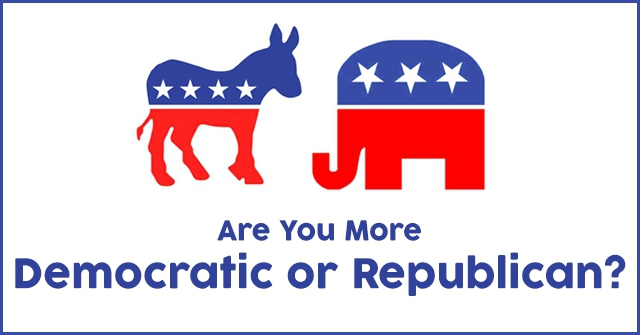

```{r setup, include=FALSE}
knitr::opts_chunk$set(echo = TRUE,
                      warning = FALSE,
                      message = FALSE)
```

The following coursebook is produced by the team at [Algoritma](www.algorit.ma) for Behavioural Data Science workshop that held by [UIN Syarif Hidayatullah Jakarta](https://www.uinjkt.ac.id/) majoring Psychology. The coursebook is intended for a restricted audience only, i.e. the individuals and organizations having received this coursebook directly from the training organization. It may not be reproduced, distributed, translated or adapted in any form outside these individuals and organizations without permission.

Algoritma is a data science education center based in Jakarta. We organize workshops and training programs to help working professionals and students gain mastery in various data science sub-fields: data visualization, machine learning, data modeling, statistical inference etc.

# Objectives
The main objective of this workshop is to introduce how data science can take a role in psichology industry. To reach the main objective, the specific objectives are to the following:   
1. To introduce data science field   
2. To solve a psychological use case using data science

# About RMarkdown

This is an RMarkdown, tool that provide a documentation friendly for R user. To run the code below, you can click on the `green-triangle-button` on the chunk (the lines that has grey color) or you can just type `ctrl+enter` on your keyboard. To make this document to be access friendly, you can klik `knit` button on the menu at the top. The file will produce a html file so you can read it in mobile or pc eventhough the R and RStudio is not installed. 

Let's begin the R and RStudio experience!

## Use cases

Predicting party affiliation from key votes on social issues

<center>

{ width=70% }

</center>

In this workshop, we will explained about how to classify a person to be a democratic or republican when they have no idea what is their political belief. This kind of classification can be used to win the election by campaigning their party to the right people.

# Load the library needed
Library or package is the collection of function that will help us work in R. The aims when using library is we do not have to wrote a long function to produce output. The library we used today are tidyverse, caret, and e1071.
```{r}
library(tidyverse) # to help us do the data wrangling
library(caret) # to make a confusion matrix
library(e1071) # to build naive bayes model
library(rsample) # to do cross validation
```

# Read and inspect the data

Before we dive deeper on making a machine learning model, we should load and inspect our data first to have some knowledge about the data itself. Today, we will use a `votes.txt` data, so we have to load it first. The data that has been available in our `data_input` folder. We can load the data to our RStudio environment by calling the `read.csv()` function and then assign to object using assignment operator `<-`.

```{r}
votes <- read.csv("data_input/votes.txt")
names(votes) <- c("party", 
                  "hcapped_infants",
                  "watercost_sharing", 
                  "adoption_budget_reso",
                  "physfee_freeze",
                  "elsalvador_aid",
                  "religious_grps",
                  "antisatellite_ban",
                  "nicaraguan_contras",
                  "mxmissile",
                  "immigration",
                  "synfuels_cutback",
                  "education_funding",
                  "superfundright_sue",
                  "crime",
                  "dutyfree_exps",
                  "expadmin_southafr"
                  )
```

After loaded and named the variabel to be more readable format, we then inspect how our data looks like using `head()` function. The `head()` will show our 6 first observation of our data.

```{r}
head(votes)
```

The data is the 1984 United States Congressional Voting records, made available by Congressional Quarterly Almanac with credits to Jeff Schlimmer. 

The description of each variable is explained below:   

- `party`: Party affiliation of the individual
- `hcapped_infants`: Handicapped Infants Protection Act (prohibits medical professionals from withholding nutrition or medical treatment from a handicapped infant)
- `watercost_sharing`: Water Project Cost Sharing: intended partly to stopping unnecessary projects (if beneficiaries know they must pay part of the cost)
- `adoption_budget_reso`: Requires the concurrent resolution on the budget to be adopted before legislation providing new budget authority
- `physfee_freeze`: Imposing a one-year freeze on Medicare payments for physicians, prevent doctors from charging mostly-elderly-or-disabled beneficiaries more
- `elsalvador_aid`: Military (arms) aid increase for El Salvador
- `religious_grps`: Legislation to guarantee equal access to school facilities by student religious groups
- `antisatellite_ban`: Preventing funds appropriated for catchall “any other act” could be used to test anti-satellite weaponry for a year
- `nicaraguan_contras`: US aid to the contrast in Nicaraguan countries
- `mxmissile`: Approval of the LGM-118 Peacekeeper, aka MX Missile Program
- `immigration`: Immigration Reform and Control Act
- `synfuels_cutback`: Funding cutback to The Synthetic Fuels Corporation (SFC)
- `education_funding`: As part of the Budget Reconciliation Act, by revising the education budget
- `superfundright_sue`: An amendment aimed at deleting a provision giving citizens the right to sue the EPA in certain cases to force action on dumps
- `crime`: The Comprehensive Crime Control Act of 1984
- `dutyfree_exps`: Granting duty-free treatment to particular items and articles (eg. water chestnuts and bamboo shoots)
- `expadmin_southafr`: Export Administration Act Amendments, which introduces some form of export (or loans) controls to South Africa

## Cross Validation

Before we build our machine learning model, we should split our data to be train and test. This activity is called cross validation. The train data used to build our model. The model will learn from the train data that we have given. Then, the test data used to get the model performance.

Here we split the data to be 80% train and 20% test using `initial_split()` function from `rsample` package

```{r}
RNGkind(sample.kind = "Rounding")
set.seed(100)
splitted <- initial_split(data = votes, strata = "party", prop = 0.8)
train <- training(splitted)
test <- testing(splitted)
```

In this workshop, we will applied Naive Bayes Algorithm to solve this problem

## Naive Bayes   

>Naive Bayes is a classification method which use bayesian theorem

### Law of Probability

Formula : $P(A) = \frac{n(A)}{n(A)+n(B)}$

where:    
$P(A)$ = Probability of observing A    
$n(A)$ = number of event A occur    
$n(B)$ = number of event B occur    

### Independent Events

Independent events is the events which occur freely of each other

Formula :   
$P(A\cap B) = P(A\mid B)\cdot P(B)$

or   

$P(A\cap B) = P(A)\cdot P(B)$

where:    
$P(A\cap B)$ = Probability of A and B occur freely of each other   
$P(A\mid B)$ = Probability of A when B occur first   
$P(B)$ = Probability of observing B    


### Dependent Events

Two events are dependent if the outcome or occurrence of the first affects the outcome or occurrence of the second so that the probability is changed. It is also called by **conditional probability**

Formula : $P(A\mid B) = \frac{P(A\cap B)}{P(B)}$

This dependent events is the basic of our naive bayes algorithm. The application of the naive bayes will be explained in the next session.

### Bayesian Theorem

Formula:  $P(A\mid B) = \frac{P(B\mid A)P(A)}{P(B)}$

Where:    
$P(A\mid B)$ = a conditional probability: the likelihood of event A occurring given that B is true.    
$P(B\mid A)$ = a conditional probability: the likelihood of event B occurring given that A is true.    
$P(A)$ and $P(B)$ = the probabilities of observing A and B respectively; they are known as the marginal probability.

### Naive Bayes Application

After having knowledge about how Naive Bayes works, now we will applied Naive Bayes Algorithm to the votes in US dataset. To call the Naive Bayes, we simply use `naiveBayes()` function from `e1071` package.

```{r}
model_naive <- naiveBayes(party~., data = train, laplace = 1)
```

The naive bayes model generate the probability of each category of being democrat and republic. Here are the two samples of the probability of each category based on handycapped infants and watercost sharing issue.

```{r}
head(model_naive$tables,2)
```

Based on the output above, we know that when someone aggree about the handycapped infants, s/he has the 0.58 probability of being democrat, and has 0.18 probability of being republican.  

#### Predicting the unseen data

Then, we should predict the unseen data using our model that we have built in previous session. 

```{r}
pred <- predict(model_naive, newdata = test)
head(pred)
```


#### Model Evaluation

Next, after we have the predicted label for each unseen data, now we should compare the predicted value with its actual value. One of the evaluation model in classification cases is confusion matrix. We can use `confusionMatrix()` from the caret package to obtain the metrics evaluation.

```{r}
confusionMatrix(pred, reference = test$party, positive = "republican")
```

Based on the confusion matrix above, we get 7 (6+1) false prediction and 79 (47+32) correct prediction. Hence, we have 0.91 or 91% accuracy for our model that we have built.
